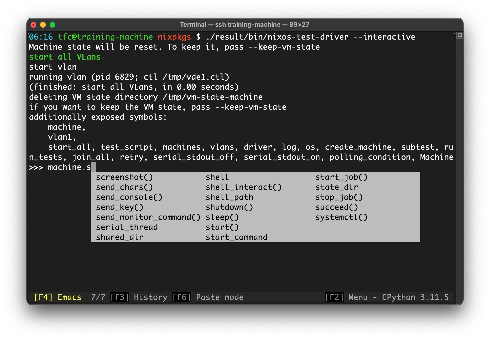
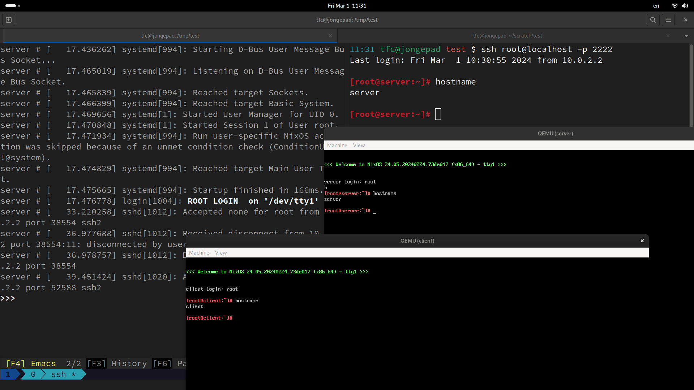

# Interactive Test Driver

One of the most powerful features of the NixOS test driver is the **interactive mode**.
It allows us to run and debug your tests step-by-step and play around in each VM interactively.

The most important use case for this are:

<!-- prettier-ignore-start -->

<div class="grid cards" markdown>

-   **Test exploration**

    Experimenting with live running nodes to find out how to test them properly

-   **Debugging failing tests**

    If a test fails in CI, we can check it out locally and run it in interactive mode.
    As soon as it fails, the test stops but does not tear down the nodes.
    Now, we can log into each VM and find out what's wrong.

</div>

<!-- prettier-ignore-end -->

## Starting the interactive mode

Assuming we normally run a test like this:

=== "Flakes"

    ```console
    nix build .#test
    ```

=== "Non-Flakes"

    ```console
    nix-build run-test.nix
    ```

For the interactive mode, we need to build the `driverInteractive` attribute first:

=== "Flakes"

    ```console
    nix build .#test.driverInteractive
    ```

=== "Non-Flakes"

    ```console
    nix-build run-test.nix -A driverInteractive
    ```

Then, we can run the interactive mode:

```console
./result/bin/run-nixos-test
```

This drops us into a Python shell (based on [IPython](https://ipython.org/)) where we can interact with the nodes:

<figure markdown="span">
  

  <figcaption>The NixOS test driver in interactive mode</figcaption>
</figure>

Running VMs will also launch with visible QEMU windows that we can interact with like this:

<figure markdown="span">
  

  <figcaption>QEMU VM windows in the interactive mode</figcaption>
</figure>

## Adding extra configuration only in interactive mode

Similar to the [`defaults` top-level attribute](../features/module-composition.md#defaults), we can add settings to virtual machines but only when the test driver is built in interactive mode:

```nix title="test.nix"
{
  name = "some test";

  nodes = {
    machine1 = { };
    machine2 = { };
  };

  interactive = {
    defaults = { pkgs, ... }: {
      environment.systemPackages = [
        pkgs.wireshark
      ];
    };

    nodes.machine2 = {
      networking.firewall.enable = false;
    };
  };

  testScript = ''
    # some testing
  '';
}
```

Package [`wireshark`](https://www.wireshark.org/) for network packet analysis is added to all nodes and only on `machine2`, the firewall is disabled.

If these settings are often needed for debugging, but never desired in non-interactive production tests, this is the perfect way to set it up.
