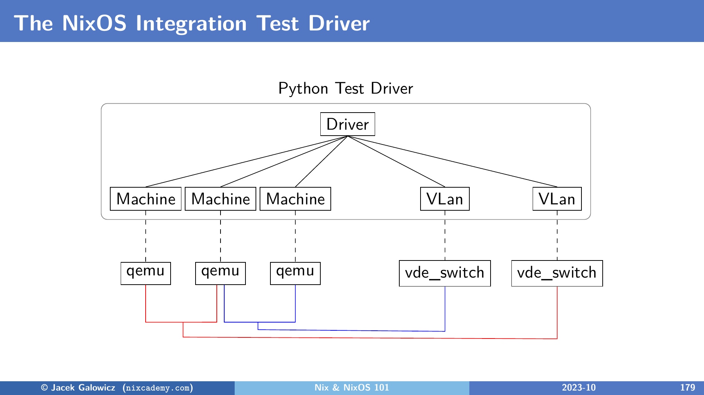

# Networking in NixOS Tests

NixOS integration tests provide a sophisticated networking environment that allows for complex multi-node and multi-network configurations.

## Architecture

The NixOS test driver uses QEMU's networking capabilities and [VDE (Virtual Distributed Ethernet) tools](https://en.wikipedia.org/wiki/Virtual_Distributed_Ethernet) to connect virtual machines.

<figure markdown="span">
  { width=500 }
  <figcaption>Test driver networking architecture</figcaption>
</figure>

As shown in the diagram, the driver orchestrates several QEMU instances and VDE switches to facilitate communication between nodes and VLANs.

## Hostname and DNS

All machines defined in your test under the top-level attributes [`nodes`](./vm.md) and [`containers`](./container.md) automatically receive DNS entries for each other.
You can use a node's name as a hostname to communicate between them.

For example, if you have nodes named `server` and `client`, the `client` can reach the `server` simply by using the name `server`.

!!! note "See a life running example in the [networking tutorial](../tutorials/multi-network-tests.md#two-nodes-on-the-same-network)"

## IP Address Assignment

By default, the test driver assigns IP addresses to each node using a fixed internal scheme:

- **VLAN 1 (default)**: Nodes get addresses like `192.168.1.1`, `192.168.1.2`, etc.
- **VLAN 2**: Nodes get addresses like `192.168.2.1`, etc.

While the default assignment is convenient, you can still use standard NixOS networking options to configure static IPs, routes, or other network settings as described in the [NixOS Manual](https://nixos.org/manual/nixos/stable/#sec-networking).

## Multiple Networks (VLANs)

You can isolate nodes into different networks using the `virtualisation.vlans` option. This is useful for testing routers, firewalls, or complex network topologies.

```nix
{
  nodes = {
    machine1 = { virtualisation.vlans = [ 1 ]; };
    machine2 = { virtualisation.vlans = [ 1 2 ]; };
    machine3 = { virtualisation.vlans = [ 2 ]; };
  };
}
```

In this setup:

- `machine1` and `machine2` can communicate on VLAN 1.
- `machine2` and `machine3` can communicate on VLAN 2.
- `machine1` and `machine3` cannot communicate directly unless `machine2` is configured to route traffic between the two networks.

!!! note "See a life running example in the [networking tutorial](../tutorials/multi-network-tests.md#using-multiple-networks-vlans)"

Another interesting real-life example is the [Bittorrent test in nixpkgs](https://github.com/NixOS/nixpkgs/blob/master/nixos/tests/bittorrent.nix) which uses the following network configuration:

<figure markdown="span">
  { width=500 }
  <figcaption>Bittorrent test multi-network configuration with NAT routing</figcaption>
</figure>
