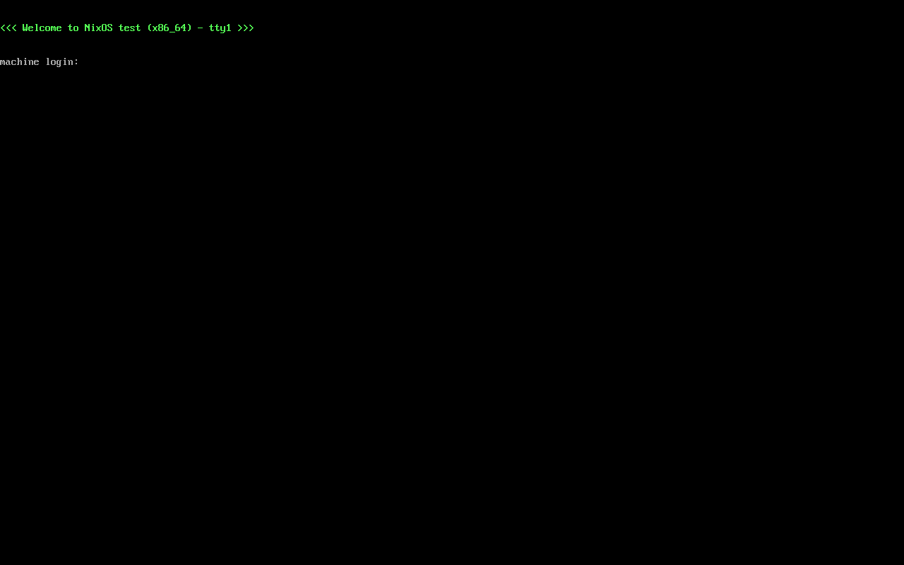
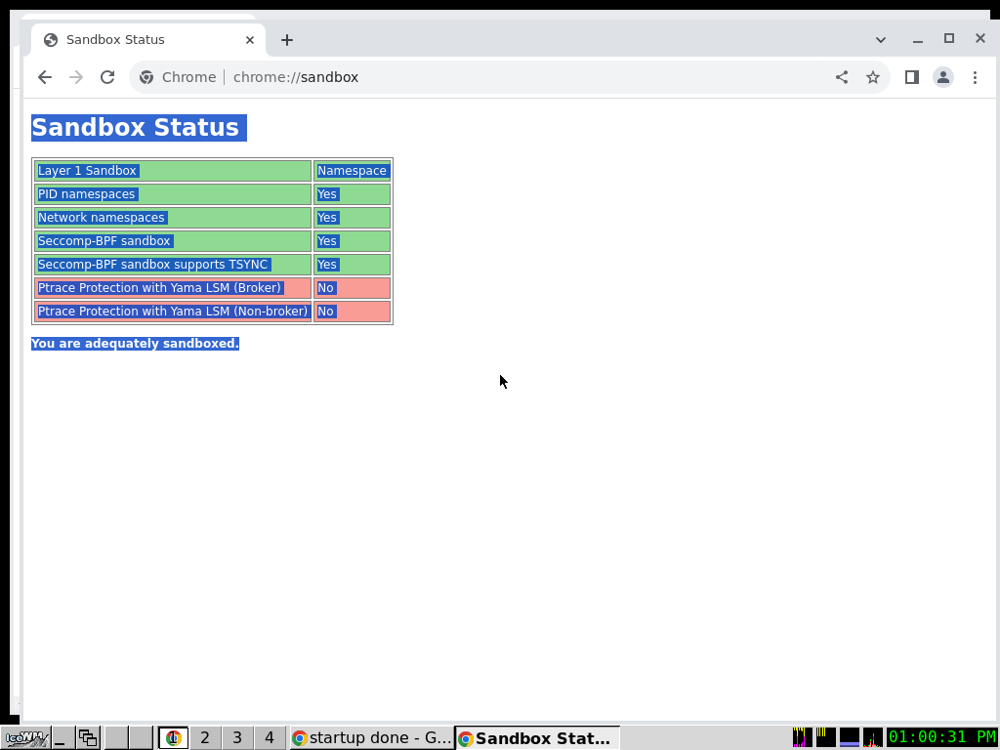
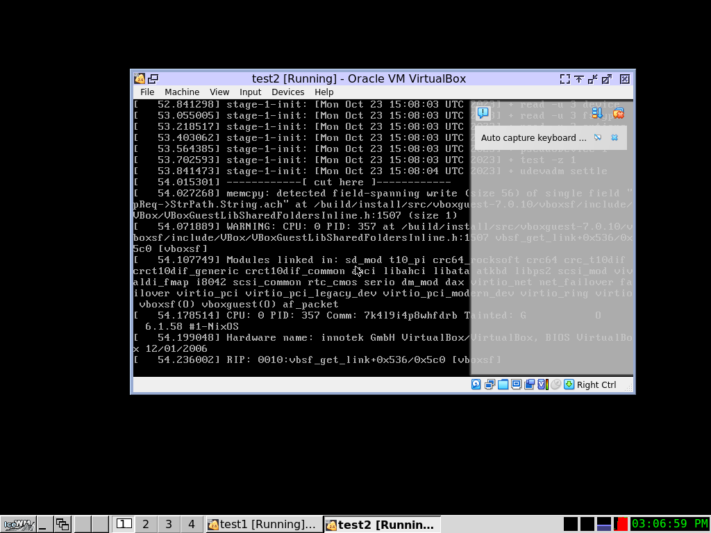
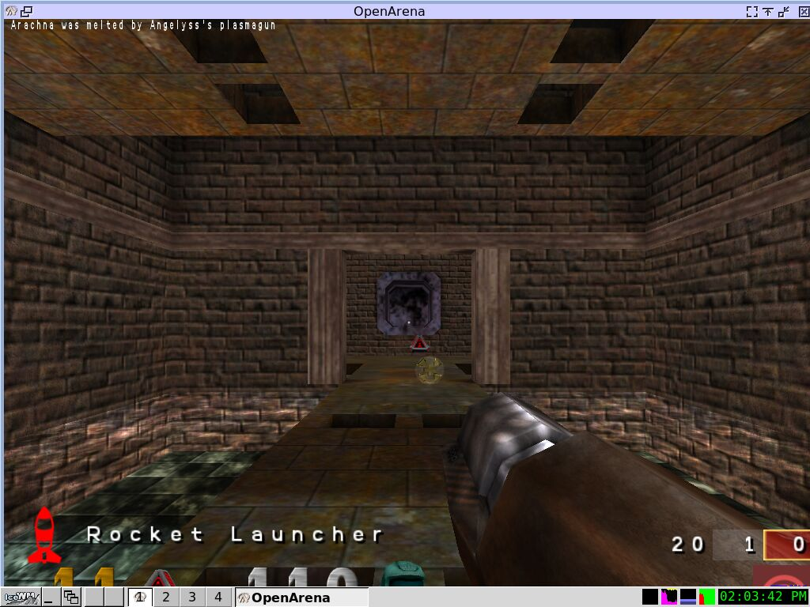
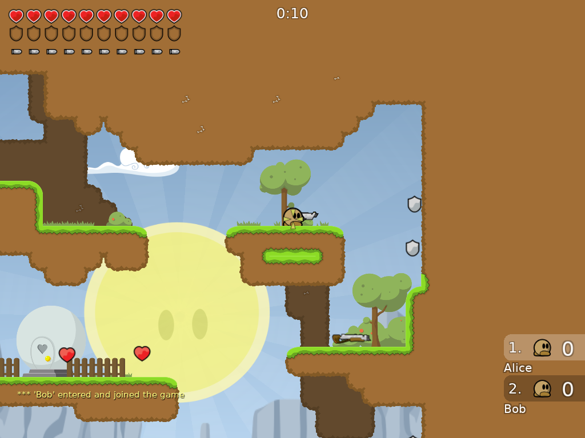
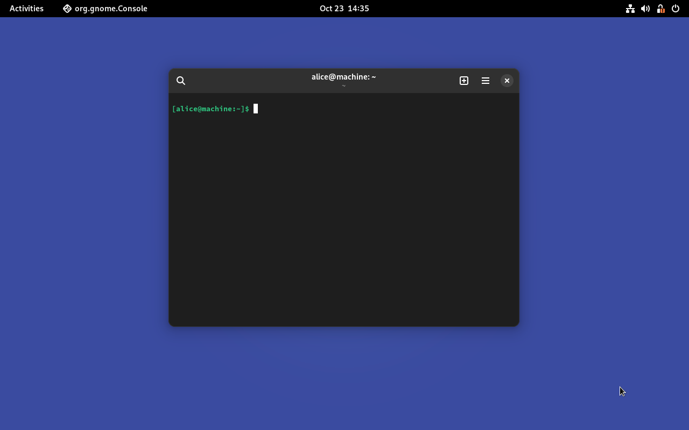
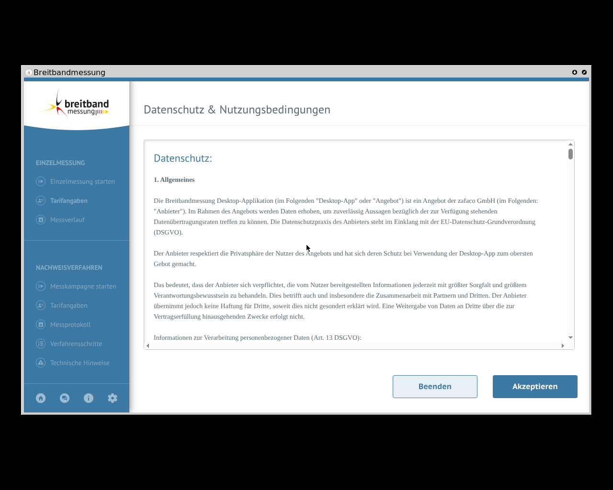

# Screenshots and OCR

!!! warning "This feature is only available in [VMs](./vm.md)"

!!! note "The examples in this repository contain a test that applies this feature. [Tutorial: Graphical VMs and OCR](../tutorials/graphical-vm-tests.md)"

## Screenshots

{ width=300 align=right }

Screenshots can be taken at any time on any VM.
The content of the screenshot is the content of the QEMU window without its frame.
As this is the raw video output, it does not matter if the VM configuration has any graphical/desktop settings at all.

To take a screenshot in the Python `testScript`, call the `screenshot(filename)` method (as [documented in the NixOS manual](https://nixos.org/manual/nixos/stable/#ssec-machine-objects)):

```python
machine.screenshot("my-screenshot")
```

The screenshot image will be stored as `my-screenshot.png` in the output folder.
If the screenshot was taken in the [interactive mode](./interactive.md), then it will be stored in the working directory.

## Configuring a graphical desktop

A VM with graphical desktop can be configured with the normal NixOS desktop configuration paths with any desktop manager/environment.

{ width=300 align=right }

The nixpkgs repository contains a minimal test desktop preset profile.
The empty desktop looks like the screenshot on the right.
To configure it, add the following to a VM's configuration

```nix
{
  # ...

  nodes = {
    my-graphical-vm = { modulesPath, ...}: { # (1)
      imports = [
        (modulesPath + "/../tests/common/x11.nix")
      ];
    };
  };

  # ...
}
```

1.  `modulesPath` is a common NixOS module system parameter and points into the `nixos/modules` subfolder of the nixpkgs repository.
    It is further explained in the [NixOS documentation](https://nixos.org/nixos/manual)

The included profile does the following (click on the links to see the implementation):

<!-- prettier-ignore-start -->

<div class="grid cards" markdown>

-   [:material-file-code: nixos/tests/common/x11.nix](https://github.com/NixOS/nixpkgs/blob/master/nixos/tests/common/x11.nix)

    ---

    - this test specific profile sets up a minimal [IceWM](https://ice-wm.org/) based desktop.
    - it also includes `auto.nix`

-   [:material-file-code: nixos/tests/common/auto.nix](https://github.com/NixOS/nixpkgs/blob/master/nixos/tests/common/auto.nix)

    ---

    - this module provides auto-login display manager settings for testing

</div>

<!-- prettier-ignore-end -->

## Setting the VM display resolution

If the VM's graphic output is too small/large, it can simply be changed in the NixOS configuration:

```nix title="test.nix"
{
  # ...

  nodes = {
    desktop-vm =
      { modulesPath, ... }:
      {
        imports = [
          (modulesPath + "/../tests/common/x11.nix") # (1)
        ];

        virtualisation.resolution = { # (2)
          x = 800;
          y = 600;
        };
      };
  };

  # ...
}
```

1.  This is the minimal testing preview from [the last section](#configuring-a-graphical-desktop).

    It is not necessary to include before changing the resolution.

2.  This parameter is defined in the [qemu-vm.nix](https://github.com/NixOS/nixpkgs/blob/master/nixos/modules/virtualisation/qemu-vm.nix#L514) profile.

## Enabling and using OCR

Using [optical character recognition (OCR)](https://en.wikipedia.org/wiki/Optical_character_recognition) in the NixOS test driver means taking a screenshot of the graphical VM output and recognizing all characters/text snippets that are visible on the screen.

This feature needs to be enabled globally using the [`enableOCR`](https://nixos.org/manual/nixos/stable/#test-opt-enableOCR) option in the test attribute like this:

```nix title="test.nix"
{
  name = "my graphical test";

  enableOCR = true;

  # ... rest of the test file
}
```

After setting this option, the following [machine methods](https://nixos.org/manual/nixos/stable/#ssec-machine-objects) are available:

| Method                                            | Description                                                                           |
| ------------------------------------------------- | ------------------------------------------------------------------------------------- |
| `client.get_screen_text()`                        | Perform OCR on a fresh screenshot and return all recognized text snippets as a string |
| `client.get_screen_text_variants()`               | Same as `get_screen_text` but returns more possible interpretations in a list.        |
| `client.wait_for_text(<regex: text to wait for>)` | Blockingly wait for a text snippet to appear on the screen.                           |

## Existing graphical tests in nixpkgs

The [`nixpkgs`](https://github.com/nixos/nixpkgs) project already contains these and more graphical tests.
Each test title links to its implementation for your inspiration.

<!-- prettier-ignore-start -->

<div class="grid cards" markdown>

-   [**Chromium sandbox test** :octicons-link-external-16:](https://github.com/NixOS/nixpkgs/blob/master/nixos/tests/chromium.nix)

    

-   [**Oracle Virtualbox test** :octicons-link-external-16:](https://github.com/NixOS/nixpkgs/tree/master/nixos/tests/virtualbox.nix)

    

-   [**Openarena multiplayer test** :octicons-link-external-16:](https://github.com/NixOS/nixpkgs/blob/master/nixos/tests/openarena.nix)

    

-   [**Teeworlds multiplayer test** :octicons-link-external-16:](https://github.com/NixOS/nixpkgs/blob/master/nixos/tests/teeworlds.nix)

    

-   [**GNOME desktop test** :octicons-link-external-16:](https://github.com/NixOS/nixpkgs/blob/master/nixos/tests/gnome.nix)

    

-   [**Electron app Breitbandmessung test** :octicons-link-external-16:](https://github.com/NixOS/nixpkgs/blob/master/nixos/tests/breitbandmessung.nix)

    

</div>

<!-- prettier-ignore-end -->
