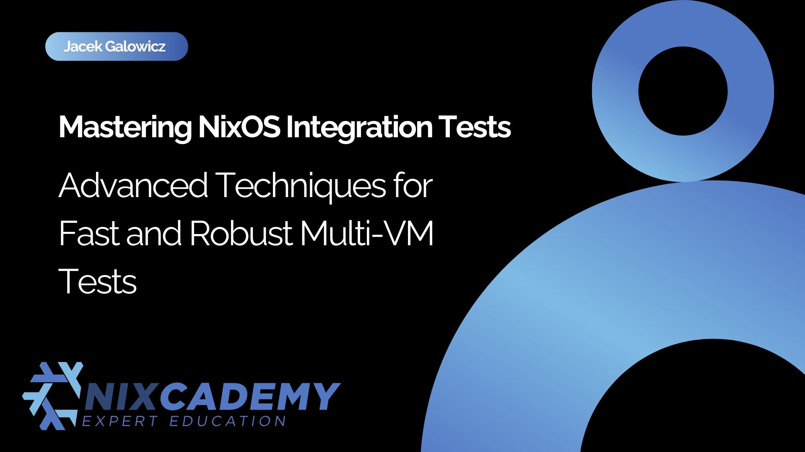

# NixOS Test Driver Manual

{ align=right width="320" }

Practical guidance for building, debugging, and scaling NixOS integration tests.

The NixOS test driver is the framework behind the integration tests used throughout [`nixpkgs`](https://github.com/NixOS/nixpkgs), where it orchestrates networks of virtual machines and other test environments.
This manual is the hands-on companion to the official documentation: opinionated, example-driven, and focused on helping you get productive quickly.

## Start Here

<!-- prettier-ignore-start -->

-   [:checkered_flag: **Setup**](./setup.md)

    ---

    Install the prerequisites and get your first test running.

-   [:playground_slide: **Tutorials**](./tutorials/index.md)

    ---

    Learn by example: minimal tests, networking, interactive debugging, graphics, overlays, and more.

-   [:map: **Features**](./features/index.md)

    ---

    Browse the driver's capabilities in focused reference-style guides.

-   [:tools: **Best practises**](./best-practises/index.md)

    ---

    Pick up patterns that make tests faster, clearer, and more reliable in CI.

<!-- prettier-ignore-end -->

## Choose Your Path

<!-- prettier-ignore-start -->

-   :material-new-box: **I am new to NixOS tests**

    Start with [Setup](./setup.md), then continue with [A minimal test](./tutorials/minimal.md).

-   :material-debug-step-over: **I need to debug a failing test**

    Go to [Interactive test driver](./features/interactive.md), [Connect to nodes via SSH/VSOCK](./tutorials/connecting-to-nodes-in-interactive.md), and [Breakpoint hook](./features/error-hook.md).

-   :material-run-fast: **I want examples I can adapt**

    Browse the [Tutorials](./tutorials/index.md) for multi-node, graphical, CUDA, and overlay-based test setups.

-   :material-palette-swatch-variant: **I want production-grade patterns**

    Read the [Best practises](./best-practises/index.md) for timeouts, synchronization, portability, and multi-node parallelism.

<!-- prettier-ignore-end -->

## Why This Manual?

The [official NixOS manual](https://nixos.org/manual/nixos/stable/#sec-nixos-tests) is the authoritative reference for the test driver.
This manual complements it with a different goal:

- explain the driver in a more guided and opinionated way
- show realistic examples instead of only listing options
- collect operational advice from day-to-day work with real test suites

If you already know the reference, this manual helps you move faster.
If you are new to the test driver, it gives you a clearer path through the material.

## Maintained in Practice

This manual is published by the [Applicative Systems Group](https://applicative.systems), which actively works with the NixOS test-driver ecosystem in practice.

The Python test driver that became the standard implementation in `nixpkgs` was authored by Jacek Galowicz ([`@tfc`](https://github.com/tfc)) together with collaborators and later adopted across the NixOS test suite.
Since then, the ecosystem has continued to grow with further work such as container support and broader operational guidance.

If you need help with NixOS integration testing, CI, or custom test infrastructure:

- contact [hello@applicative.systems](mailto:hello@applicative.systems)
- join the [Applicative Systems Matrix channel](https://matrix.to/#/#applicative.systems:matrix.org)
- report issues on [GitHub](https://github.com/applicative-systems/nixos-test-driver-manual/issues)

## Background

The NixOS test driver has a long history in `nixpkgs`:

- the original VM test framework was introduced in 2009
- the Python driver was introduced in 2019 by Jacek Galowicz ([`@tfc`](https://github.com/tfc)) together with Julian Stecklina ([@blitz](https://github.com/blitz)) and Jana Traue ([@jtraue](https://github.com/jtraue)) and became the standard implementation
- container support has been added in 2026 by Jacek Galowicz ([`@tfc`](https://github.com/tfc)), Kierán Meinhardt ([`@kmein`](https://github.com/kmein)), and Jeremy Fleischman ([`@jfly`](https://github.com/jfly)), based on a first implementation by the [Clan project](https://clan.lol/).

The test driver is used by [1000+ tests in nixpkgs](https://github.com/NixOS/nixpkgs/tree/master/nixos/tests) and has hundreds of industrial downstream users.

## Talks and Deep Dives

<!-- prettier-ignore-start -->

-   **Mastering NixOS Integration Tests Part 1**

    ---

    { width=200 align=left }

    A deep dive into the test driver architecture and how to structure larger test suites.

    [**Visit**](https://nixcademy.com/posts/nixos-integration-tests/)

-   **Mastering NixOS Integration Tests Part 2**

    ---

    { align=left width=200 }

    Interactive debugging, OCR, and practical techniques for productive test development.

    [**Visit**](https://nixcademy.com/posts/nixos-integration-tests-part-2/)

-   **Faster, Cheaper NixOS Integration Tests**

    ---

    { width=200 align=left }

    Using containers to accelerate integration testing without sacrificing the isolation of full virtual machines.

    [**Visit**](https://nixcademy.com/posts/faster-cheaper-nixos-integration-tests-with-containers/)

-   **Running Integration Tests on macOS**

    ---

    { width=200 align=left }

    Cross-platform developer workflows for running NixOS integration tests on Apple Silicon.

    [**Visit**](https://nixcademy.com/posts/running-nixos-integration-tests-on-macos/)

-   **NixOS Integration Tests on GitHub Actions**

    ---

    { width=200 align=left }

    Bringing the test driver into modern CI pipelines on GitHub Actions.

    [**Visit**](https://nixcademy.com/posts/nixos-integration-test-on-github/)

-   **NixCon Talk: Mastering NixOS Integration Tests**

    ---

    { width=200 align=left }

    Slides and examples from the NixCon and Planet Nix workshop on the test driver.

    [**Visit**](https://github.com/applicative-systems/nixos-test-driver-nixcon)

<!-- prettier-ignore-end -->
