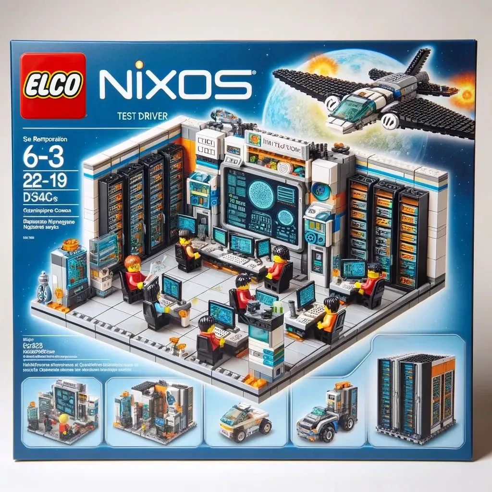

# NixOS Test Driver Manual

{ align=right width="300" }

The NixOS integration test driver is a framework for orchestrating networks of virtual machines for testing purposes.
The [nixpkgs](https://github.com/nixos/nixpkgs) project, the biggest open source package collection in the world, uses it with [more than a thousand tests](https://github.com/NixOS/nixpkgs/tree/master/nixos/tests) to check packages and NixOS services.

## Difference to the official documentation

The NixOS test driver belongs to the [`nixpkgs`](https://github.com/nixos/nixpkgs) repository and is documented in the [NixOS manual](https://nixos.org/manual/nixos/stable/#sec-nixos-tests).

The official manual is a complete reference guide. This manual, on the other hand, is opinionated and more hands-on, designed to help beginners get started quickly.

## Getting Started

<!-- prettier-ignore-start -->

- [:checkered_flag: **Setup**](./setup.md): Prerequisites and your first test.
- [:playground_slide: **Tutorials**](./tutorials/minimal.md): Practical, step-by-step guides.
- [:map: **Features**](./features/index.md): Deep dives into the driver's capabilities.
- [:tools: **Best practises**](./best-practises/index.md): Do's and dont's from experience.

<!-- prettier-ignore-end -->

## Further resources

<!-- prettier-ignore-start -->

-   **Faster, Cheaper NixOS Integration Tests**

    ---

    { width=200 align=left }

    Using containers to accelerate integration testing without sacrificing the isolation of full virtual machines.

    [**Visit**](https://nixcademy.com/posts/faster-cheaper-nixos-integration-tests-with-containers/)

-   **NixOS Integration Tests on GitHub Actions**

    ---

    { width=200 align=left }

    Bringing high-assurance testing to modern CI/CD pipelines with seamless GitHub integration.

    [**Visit**](https://nixcademy.com/posts/nixos-integration-test-on-github/)

-   **Mastering NixOS Integration Tests Part 1**

    ---

    { width=200 align=left }

    A deep dive into the architecture of the NixOS test driver and how to structure complex validation suites.

    [**Visit**](https://nixcademy.com/posts/nixos-integration-tests/)

-   **Mastering NixOS Integration Tests Part 2**

    ---

    { align=left width=200 }

    Discover the test driver architecture, setup, interactive debugging, and OCR for efficient, reproducible testing.

    [**Visit**](https://nixcademy.com/posts/nixos-integration-tests-part-2/)

-   **Running Integration Tests on macOS**

    ---

    { width=200 align=left }

    Enabling cross-platform developer workflows by running NixOS VM tests directly on Apple Silicon.

    [**Visit**](https://nixcademy.com/posts/running-nixos-integration-tests-on-macos/)

<!-- prettier-ignore-end -->

- [NixCon Demo Repository](https://github.com/applicative-systems/nixos-test-driver-nixcon)
- [GPU Acceleration in Tests](https://github.com/applicative-systems/nixos-gpu-tests)
