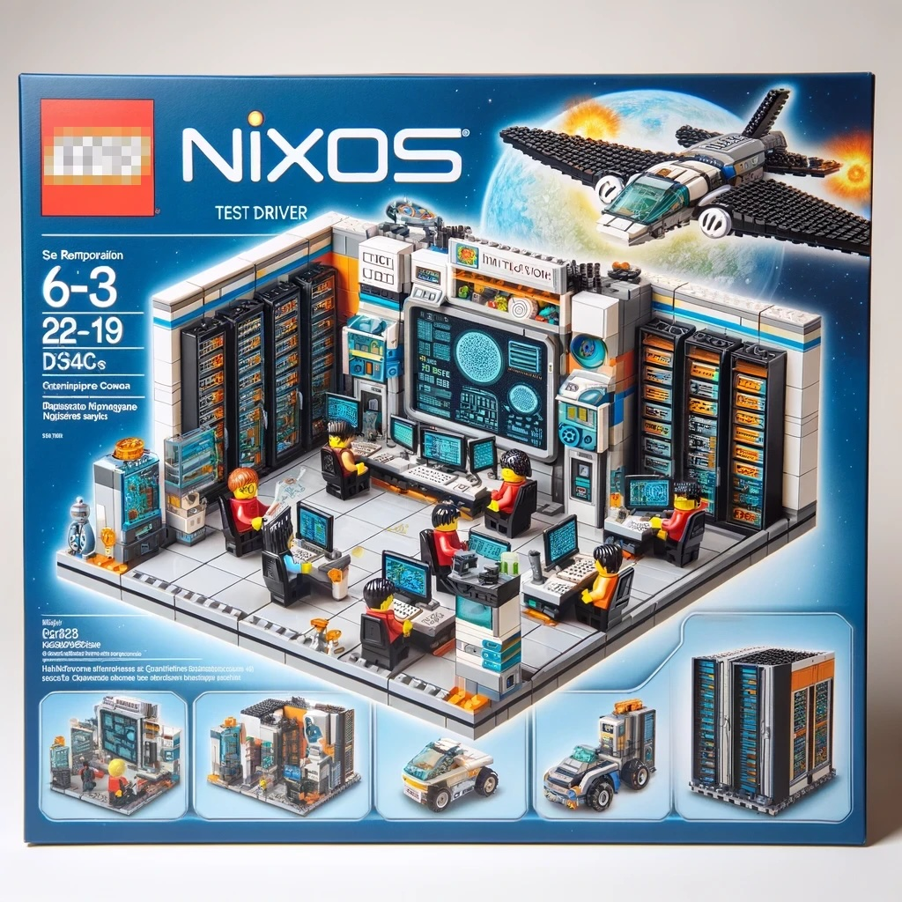

# NixOS Test Driver Manual

{ align=right width="300" }

The NixOS integration test driver is a framework for orchestrating networks of virtual machines for testing purposes.
The [nixpkgs](https://github.com/nixos/nixpkgs) project, the biggest open source package collection in the world, uses it with [more than a thousand tests](https://github.com/NixOS/nixpkgs/tree/master/nixos/tests) to check packages and NixOS services.

## Official Documentation

The NixOS test driver belongs to the `nixpkgs` repository and is documented in the [NixOS manual](https://nixos.org/manual/nixos/stable/#sec-nixos-tests).

The official manual is a complete reference guide. This manual, on the other hand, is opinionated and more hands-on, designed to help beginners get started quickly.

## Getting Started

- [**Setup**](./setup.md): Prerequisites and your first test.
- [**Tutorials**](./tutorials/minimal.md): Practical, step-by-step guides.
- [**Features**](./features/index.md): Deep dives into the driver's capabilities.

## Tutorials

- [**A minimal NixOS test**](./tutorials/minimal.md)
- [**Connecting to Nodes in Interactive Mode**](./tutorials/connecting-to-nodes-in-interactive.md)
- [**Multi-node and Multi-network Tests**](./tutorials/multi-network-tests.md)
- [**Bundling Tests with a Package**](./tutorials/test-in-extra-package.md)

## Resources

- [Introduction to NixOS Integration Tests](https://nixcademy.com/posts/nixos-integration-tests/)
- [Deep Dive into Architecture](https://nixcademy.com/posts/nixos-integration-tests-part-2/)
- [Running Tests on macOS](https://nixcademy.com/posts/running-nixos-integration-tests-on-macos/)
- [GitHub Actions Integration](https://nixcademy.com/posts/nixos-integration-test-on-github/)
- [Faster Container-based Tests](https://nixcademy.com/posts/faster-cheaper-nixos-integration-tests-with-containers/)
- [NixCon Demo Repository](https://github.com/applicative-systems/nixos-test-driver-nixcon)
- [GPU Acceleration in Tests](https://github.com/applicative-systems/nixos-gpu-tests)
