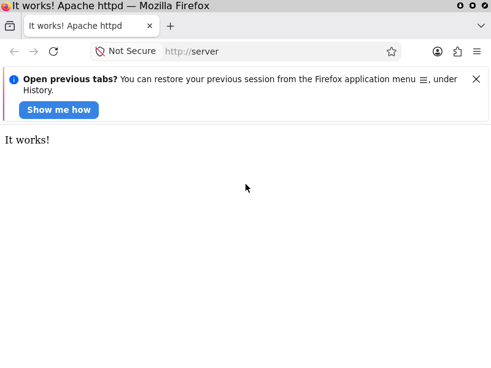

# Graphical VMs and OCR

Let's test something with [optical character recognition (OCR)](https://en.wikipedia.org/wiki/Optical_character_recognition) in a graphical VM.

!!! note "For more general information about screenshots and OCR [refer to the features section](../features/screenshots-and-ocr.md)"

!!! example "Run this example test yourself"

    To run this test directly from the example repository, run:

    === "Interactive with graphics"

        ```console
        nix run github:applicative-systems/nixos-test-driver-manual#test-browser.driverInteractive
        ```

        Then enter `run_tests()` in the interactive terminal.

        You will be able to see the graphical desktop and watch the test happening.

    === "Non-interactive"

        ```console
        nix build -L github:applicative-systems/nixos-test-driver-manual#test-browser
        ```

In this scenario, we define a machine `server` that serves the standard [Apache HTTP server](https://httpd.apache.org/) _"It works!"_ page.
On the second machine, `client`, we run [Mozilla Firefox](https://www.firefox.com) to display this page and test if the text is really visible on the graphical desktop.
In the end, we perform a screenshot:

<figure markdown="span">
  { width=400 }

  <figcaption>The screenshot at the and of the test</figcaption>
</figure>

```nix title="browser.nix"
--8<-- "examples/browser.nix"
```

1.  **Enabling OCR**

    This setting adds `tesseract` and `imagemagick` to the test driver closure.
    It is not enabled by default to reduce the closure for non-graphical tests, which are the majority.

2.  **Configuring the desktop**

    This profile is commonly used among graphical tests in nixpkgs and configures a small desktop environment with auto login.

    Importing this file is not mandatory - we can always configure this ourselves.

3.  **Resolution settings**

    We reduce the display resolution to result in fewer pixels, which in turn reduces the resource usage of the Tesseract OCR analysis.

We use the following specialized graphical machine methods on the client:

| Method                                            | Description                                                                           |
| ------------------------------------------------- | ------------------------------------------------------------------------------------- |
| `client.wait_for_x()`                             | Blockingly wait for the X server to become available                                  |
| `client.wait_for_window(<string: window title>)`  | Blockingly wait for a window to show up                                               |
| `client.screenshot(<string: image base name>)`    | Create a plain screenshot and store it in the output folder of the test derivation    |
| `client.get_screen_text()`                        | Perform OCR on a fresh screenshot and return all recognized text snippets as a string |
| `client.wait_for_text(<regex: text to wait for>)` | Blockingly wait for a text snippet to appear on the screen                            |

This list is not complete.
For more details and methods, refer to the [official manual](https://nixos.org/manual/nixos/stable/#ssec-machine-objects).
