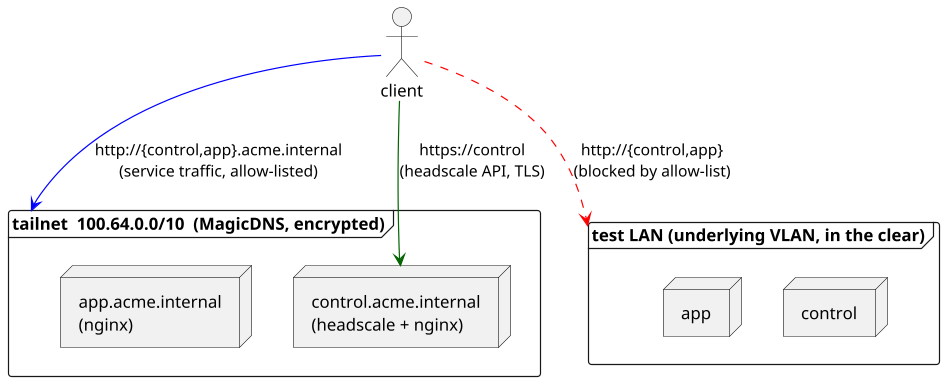

# Testing a Self-Hosted Mesh VPN: Headscale + Tailscale on NixOS

[Tailscale](https://tailscale.com/) makes "every device on its own private network" feel effortless, but in many production scenarios you do not want the control plane to sit in a third-party cloud.
[Headscale](https://headscale.net/) is the popular open-source reimplementation of that control plane — the same Tailscale clients keep working, but the coordination server is yours.

This tutorial builds a fully reproducible [NixOS integration test](https://nixos.org/manual/nixos/stable/#sec-nixos-tests) that spins up:

- a self-hosted Headscale control server with its own embedded [DERP](https://tailscale.com/kb/1232/derp-servers) relay,
- two HTTP services behind [nginx](https://nginx.org/), reachable only over the tailnet,
- an end-user client device that joins the tailnet and verifies end-to-end connectivity, [MagicDNS](https://tailscale.com/kb/1081/magicdns), and the tailnet allow-list.

In other words: an entire private mesh VPN, provisioned, joined, and exercised from scratch — in seconds, on every CI run.

Three things make this more than a "VPN works" smoke test:

- **[MagicDNS](https://tailscale.com/kb/1081/magicdns) is validated end-to-end** — the part of Tailscale that people most often misconfigure.
- **The allow-list is checked as a negative test.** Proving the services are reachable _only_ through the tailnet is the difference between defence in depth and the illusion of it.
- **The whole thing is hermetic.** No external Headscale, no real Tailscale coordination, no network access required — it runs the same way on your laptop and in CI.

It is also a fair template for any private-overlay setup built on Tailscale or Headscale: [WireGuard](https://www.wireguard.com/) configurations, [ACLs](https://tailscale.com/kb/1018/acls), subnet routers, exit nodes, [`tsnet`](https://tailscale.com/kb/1244/tsnet) applications.

!!! example "Run this example test yourself"

    ```console
    nix build -L github:applicative-systems/nixos-test-driver-manual#test-headscale
    ```

## What you will validate

By the end of the test, you will have proven — automatically, in a sandbox — that:

- [x] Headscale comes up and serves its API over HTTPS with a self-signed certificate the clients trust.
- [x] Two infrastructure machines join the tailnet using a pre-shared admin key (the bootstrap flow you would use in real production with [agenix](https://github.com/ryantm/agenix) or [sops-nix](https://github.com/Mic92/sops-nix)).
- [x] An end-user client joins separately with its own ephemeral key (the laptop/phone flow).
- [x] All nodes can reach each other via [`tailscale ping`](https://tailscale.com/kb/1080/cli#ping).
- [x] HTTP services resolve and respond via [MagicDNS](https://tailscale.com/kb/1081/magicdns) on `*.acme.internal`.
- [x] The same services are **unreachable** over the underlying test LAN — the nginx allow-list really gates traffic by tailnet CIDR.

## Architecture



Three NixOS nodes, one tailnet, two reachability assertions, and two reachability **non**-assertions.
The whole arrangement is described in a single test file.

## The test

```nix title="headscale.nix"
--8<-- "examples/headscale.nix"
```

<!-- prettier-ignore-start -->

1.  **A self-signed TLS certificate**

    Tailscale clients require an HTTPS control server. We mint a one-shot
    self-signed certificate in a `runCommand` derivation and distribute it to
    every node via [`security.pki.certificateFiles`](https://search.nixos.org/options?show=security.pki.certificateFiles).
    Setting that option once under the test's top-level
    [`defaults`](../features/module-composition.md#defaults) is enough — it
    is merged into every node, so all three machines trust the cert without
    repeating the line.

2.  **`helloVhost` — the tailnet-only HTTP service**

    A small NixOS module that defines an [nginx](https://nginx.org/) virtual host
    returning `hello from <hostname>`. The `allow ${tailnetCidrV4}; deny all;`
    block is the entire allow-list — only traffic with a source IP in the
    tailnet CIDR is served. The matching `tailscale0` firewall rule keeps
    the port open exclusively on the tailnet interface. We will assert later
    that this really blocks LAN traffic.

3.  **`tailscaleJoin` — the client side of the mesh**

    Enables [`services.tailscale`](https://search.nixos.org/options?show=services.tailscale.enable)
    and points it at our Headscale instance via the pre-auth key on disk.
    `extraUpFlags` sets the [`--login-server`](https://tailscale.com/kb/1080/cli#up)
    and a stable hostname.

4.  **`headscaleControlPlane` — the coordination server**

    The [Headscale](https://headscale.net/) service itself, the matching
    firewall rule for its built-in [DERP](https://tailscale.com/kb/1232/derp-servers)
    relay, and the CLI tools (`headscale`, `jq`) the test script needs to
    bootstrap the tailnet.

5.  **The embedded DERP relay**

    Tailscale uses [DERP](https://tailscale.com/kb/1232/derp-servers) relays
    as a fallback path when peer-to-peer NAT traversal fails. In an isolated
    test VLAN with no public STUN servers reachable, that fallback is the only
    reliable path, so we enable Headscale's built-in DERP server. We pin its
    IPv4 to `config.networking.primaryIPAddress` to short-circuit `tailscaled`'s
    `netcheck`, which would otherwise try to resolve the test-VLAN hostname.

6.  **`tlsReverseProxy` — HTTPS in front of Headscale**

    Tailscale clients refuse to talk to an HTTP control server, so we put
    nginx in front of Headscale and terminate TLS with our self-signed cert.
    Combined with `helloVhost` on the same machine, `control` ends up running
    two virtual hosts: the "hello" vhost (default, port 80, tailnet only) and
    the `control` vhost (HTTPS, port 443, reverse-proxying to Headscale).
    The NixOS module system merges both `services.nginx` blocks automatically.

7.  **The composed control server**

    `control` is now a one-liner of imports — `helloVhost`, `tailscaleJoin`,
    `headscaleControlPlane`, `tlsReverseProxy`. Each module owns exactly one
    concern; the node definition reads like an inventory. `app` keeps only
    the two modules it needs, and `client` is plain `services.tailscale.enable`.
    See also the [feature page on module composition](../features/module-composition.md).

<!-- prettier-ignore-end -->

## How the test script flows

The `testScript` reads like a short runbook for a fresh deployment, which is exactly the point.

### 1. Bring services up

```python
control.wait_for_unit("headscale.service")
control.wait_for_open_port(443)
# ...
```

Standard [machine wait helpers](https://nixos.org/manual/nixos/stable/#ssec-machine-objects) — wait for systemd units and the HTTPS port to be available.

### 2. Bootstrap the admin pre-auth key

```python
user_id = control.succeed(
    "headscale users create infra --output json | jq -r .id"
).strip()
auth_key = control.succeed(
    f"headscale preauthkeys create --user {user_id} --reusable --expiration 24h "
    "--output json | jq -r .key"
).strip()

for s in [control, app]:
    s.succeed(
        f"umask 077 && mkdir -p $(dirname {auth_key_path}) && "
        f"echo {auth_key} > {auth_key_path}"
    )
    s.succeed("systemctl restart tailscaled-autoconnect.service")
```

This is the once-per-deployment ritual: create a Headscale user, then mint a reusable [pre-auth key](https://tailscale.com/kb/1085/auth-keys) that infra machines can use to join unattended. `headscale preauthkeys create --user` takes a numeric user ID rather than the name, so we grab it from the user-creation JSON output and reuse it for both the infra and the client key below. In a real cluster you would now ship this key into your secret manager ([agenix](https://github.com/ryantm/agenix), [sops-nix](https://github.com/Mic92/sops-nix), …) and roll out the configuration. The test emulates that step with `umask 077` so the key file lands with secret-appropriate permissions, then restarts `tailscaled-autoconnect` — which had failed at boot when the key file did not yet exist.

### 3. Let the client join the human way

```python
client_key = control.succeed("headscale preauthkeys create ...").strip()
client.execute(f"tailscale up --login-server 'https://control' --auth-key {client_key} ...")
```

End-user devices normally join through a browser flow — but it is the same `tailscale up` underneath. We use a second pre-auth key to keep the test deterministic.

### 4. Wait for a working tailnet path

```python
client.wait_until_succeeds("tailscale ping --c 1 --timeout 2s control")
client.wait_until_succeeds("tailscale ping --c 1 --timeout 2s app")
```

[`tailscale ping`](https://tailscale.com/kb/1080/cli#ping) does not use ICMP — it pings over the tailnet itself, including DERP fallback. A successful `tailscale ping` is the strongest "the mesh is actually working" signal you can get without writing application traffic.

### 5. Hit the services via MagicDNS

```python
out1 = client.succeed("curl --fail --max-time 5 http://control.acme.internal/")
assert "hello from control" in out1, f"unexpected: {out1!r}"
```

[MagicDNS](https://tailscale.com/kb/1081/magicdns) resolves the hostnames inside the tailnet. The fact that `curl` succeeds — and that the response really came from the right host — closes the loop.

### 6. Verify the LAN is **not** a backdoor

```python
client.fail("curl --fail --max-time 5 http://control/")
client.fail("curl --fail --max-time 5 http://app/")
```

This is the subtle but important part. The test driver gives every node a regular VLAN where `control`/`app` resolve to LAN IPs. If the nginx allow-list were misconfigured, `curl http://control/` would _also_ succeed and the tailnet would not actually be enforcing anything. Asserting `.fail()` here is what turns "the services are reachable" into "the services are reachable **only through the tailnet**".

## Related references

<!-- prettier-ignore-start -->

<div class="grid cards" markdown>

-   [:simple-tailscale: **Tailscale**](https://tailscale.com/)

    ---

    The mesh VPN built on top of [WireGuard](https://www.wireguard.com/). This test exercises real Tailscale clients against a self-hosted control plane.

-   [:material-server-security: **Headscale**](https://headscale.net/)

    ---

    Open-source, self-hosted implementation of the Tailscale coordination server. The [GitHub project](https://github.com/juanfont/headscale) has the full feature matrix.

-   [:simple-nixos: **NixOS test driver manual**](https://nixos.org/manual/nixos/stable/#sec-nixos-tests)

    ---

    The reference manual chapter for the framework that runs this test. Worth a bookmark.

-   [:material-server-network-outline: **Multi-node and multi-network tests**](./multi-network-tests.md)

    ---

    The foundation tutorial for tests that orchestrate several machines on isolated VLANs.

-   [:material-console: **Interactive mode**](../features/interactive.md)

    ---

    Build the test as `.driverInteractive` and step through it from an IPython prompt — `tailscale status`, `tailscale netcheck`, and friends, on the running VMs.

-   [:material-ssh: **Connecting to nodes interactively**](./connecting-to-nodes-in-interactive.md)

    ---

    When a mesh refuses to converge, the fastest path forward is a shell on the affected node.

-   [:material-puzzle: **Module composition**](../features/module-composition.md)

    ---

    The `helloVhost` / `tailscaleJoin` reusable modules in this test follow the standard NixOS module pattern — same as `nixpkgs` itself.

</div>

<!-- prettier-ignore-end -->
