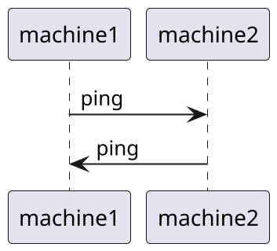
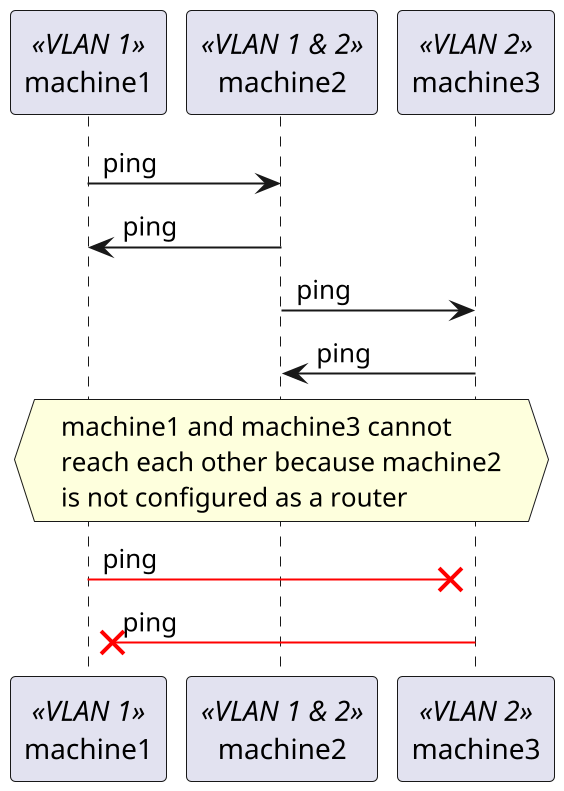
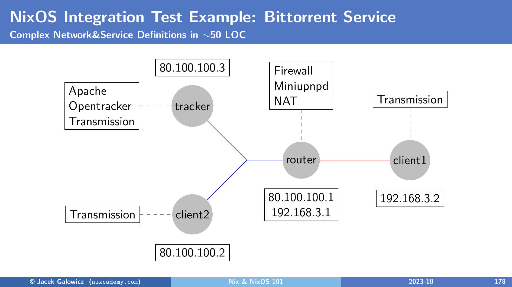

# Multi-node and Multi-network Tests

NixOS integration tests excel at orchestrating complex network setups with multiple machines and networks.

## Two Nodes on the Same Network

By default, nodes in a test can communicate with each other using their hostnames.

In this example, we let two machines ping each other:



!!! example "Run this example test yourself"

    To run this test directly from the example repository, run:

    ```console
    nix build -L github:applicative-systems/nixos-test-driver-manual#test-ping
    ```

```nix title="ping.nix"
--8<-- "examples/ping.nix"
```

## Using Multiple Networks (VLANs)

You can isolate nodes into different networks by using the `virtualisation.vlans` option (see also [official docs](https://nixos.org/manual/nixos/stable/#sec-nixos-test-nodes)).

In this example, we set up two networks with 3 machines, but without routing.
Then, we let them ping each other:



!!! example "Run this example test yourself"

    To run this test directly from the example repository, run:

    ```console
    nix build -L github:applicative-systems/nixos-test-driver-manual#test-multi-network
    ```

```nix title="multi-network.nix"
--8<-- "examples/multi-network.nix"
```

VLANs are a powerful way to test complex network architectures like firewalls, routers, and isolated service enclaves.

Another interesting real-life example is the [Bittorrent test in nixpkgs](https://github.com/NixOS/nixpkgs/blob/master/nixos/tests/bittorrent.nix) which uses the following network configuration:

<figure markdown="span">
  { width=500 }
  <figcaption>Bittorrent test multi-network configuration with NAT routing</figcaption>
</figure>
